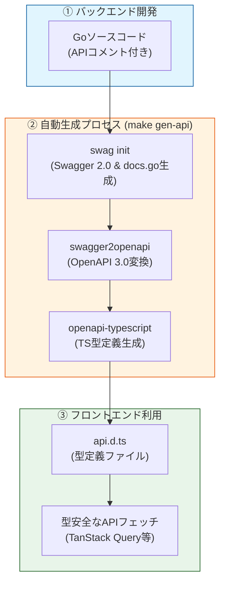

# Salon App プロジェクト構成概要

本プロジェクトは、Go（バックエンド）とNext.js（フロントエンド）を組み合わせたサロン顧客管理アプリケーションです。

## 技術スタック

### バックエンド (Backend)
- **言語**: Go 1.25 (Dockerfile) / 1.23 (go.mod)
- **Webフレームワーク**: [Gin](https://gin-gonic.com/)
- **ORM**: [GORM](https://gorm.io/) (PostgreSQL)
- **APIドキュメント**: [swag](https://github.com/swaggo/swag) (Swagger 2.0 / OpenAPI 3.0)
- **主なライブラリ**:
  - `github.com/gin-contrib/cors`: CORS設定
  - `github.com/swaggo/gin-swagger`: Swagger UIの統合
  - `gorm.io/driver/postgres`: PostgreSQLドライバ

### フロントエンド (Frontend)
- **フレームワーク**: [Next.js 16.1.6](https://nextjs.org/) (App Router)
- **UIライブラリ**: [React 19](https://react.dev/)
- **言語**: TypeScript
- **スタイリング**: [TailwindCSS 4](https://tailwindcss.com/)
- **状態管理/データフェッチ**: [TanStack Query v5](https://tanstack.com/query/latest) (React Query)
- **型生成**: [openapi-typescript](https://openapi-ts.pages.dev/) (OpenAPIからTypeScript型を自動生成)

### インフラ・開発ツール (Infrastructure & Tools)
- **コンテナ化**: Docker / Docker Compose
- **データベース**: PostgreSQL 15 (Alpine)
- **ホットリロード**: [Air](https://github.com/air-verse/air) (バックエンド開発用)
- **タスクランナー**: Makefile

---

## ディレクトリ構成

```text
salon-app/
├── backend/                # Go バックエンド
│   ├── cmd/                # エントリポイント
│   │   └── main.go         # サーバー起動設定、基本ルート
│   ├── internal/           # 内部ロジック（カプセル化）
│   │   ├── db/             # DB接続設定 (client.go)
│   │   ├── handler/        # リクエストハンドラ (handler.go)
│   │   ├── model/          # データモデル定義 (user.go)
│   │   └── utils/          # ユーティリティ (jwt.go, utils.go)
│   ├── docs/               # 生成されたSwagger/OpenAPIドキュメント
│   ├── .air.toml           # Air（ホットリロード）設定
│   ├── Dockerfile          # バックエンド用ビルド設定
│   └── go.mod / go.sum     # Go 依存管理
├── frontend/               # Next.js フロントエンド
│   ├── public/             # 静的アセット（logo.png, favicon.ico 等）
│   ├── src/
│   │   ├── api/            # API連携
│   │   │   └── api.d.ts    # 自動生成されたTypeScript型定義
│   │   ├── app/            # App Router 画面・レイアウト
│   │   │   ├── layout.tsx  # ルートレイアウト（メタデータ、Providers等）
│   │   │   ├── page.tsx    # ホーム画面（疎通確認テスト含む）
│   │   │   ├── providers.tsx # React Query等の設定
│   │   │   └── globals.css # グローバルスタイル
│   │   └── hooks/          # カスタムフック (useUsers.ts等)
│   ├── next.config.ts      # Next.js 設定
│   ├── package.json        # フロントエンド依存管理
│   └── tsconfig.json       # TypeScript 設定
├── docker-compose.yml      # 全体コンテナ構成（db, backend）
├── Makefile                # 開発用コマンド（gen-api等）
└── .env                    # 環境変数（DB接続情報等）
```

---

## 主要な開発ワークフロー

### APIドキュメント・型生成
バックエンドのコードからSwaggerドキュメントを生成し、それを基にフロントエンド用のTypeScript型定義を作成します。

```bash
make gen-api
```
このコマンドは以下の処理を順次実行します：
1. `swag init`: Goのコメントから Swagger 2.0 ファイルおよび `docs/docs.go` を生成。
2. `swagger2openapi`: Swagger 2.0 を OpenAPI 3.0 に変換。
3. `openapi-typescript`: OpenAPI 3.0 から TypeScript 型定義を生成。

### データベース同期
バックエンド起動時にGORMの `AutoMigrate` 機能を使用して、`internal/model` で定義された構造体を基にDBテーブルを自動生成・更新します。

---

## API管理フロー (API Management Flow)

本プロジェクトでは、**バックエンドのコード（Go）を正（Source of Truth）**として、APIドキュメントおよびフロントエンドの型定義を自動生成します。

### フロー図


### 管理手順
1. **バックエンドでのAPI修正**: `backend/cmd/main.go` 等でエンドポイントやコメント（`@Summary`, `@Success` 等）を更新。
2. **自動生成実行**: プロジェクトルートで以下を実行。
   ```bash
   make gen-api
   ```
3. **フロントエンドでの利用**: `frontend/src/api/api.d.ts` に生成された型をインポートして利用。

### 具体的なデータの流れ（例）

例えば、ユーザー情報に「電話番号（Phone）」を追加する場合の流れは以下の通りです。

#### 1. バックエンドのモデル修正 (`backend/internal/model/user.go`)
構造体にフィールドを追加し、Swaggerコメント用のタグ（`json:"xxx"`）を記述します。
```go
type User struct {
    gorm.Model
    Name  string `json:"name"`
    Email string `json:"email" gorm:"unique"`
    Phone string `json:"phone"` // ← 追加
}
```

#### 2. 自動生成の実行
ルートディレクトリでコマンドを実行します。
```bash
make gen-api
```
これにより、`backend/docs/openapi.yaml` が更新され、最終的に `frontend/src/api/api.d.ts` に以下のTypeScript型が自動生成されます。
```typescript
// frontend/src/api/api.d.ts 内（自動生成された型の一部）
export interface User {
  id?: number;
  name?: string;
  email?: string;
  phone?: string; // ← 自動的に生えてくる
}
```

#### 3. フロントエンドでの利用
インポートした型を利用することで、補完が効いた状態で開発できます。
```typescript
// frontend/src/hooks/useUsers.ts 等
const user: User = data;
console.log(user.phone); // 型安全にアクセス可能
```

---

## 主要な開発ワークフロー

### Docker Compose (推奨)
データベースとバックエンドをコンテナで起動します。
```bash
docker compose up --build
```

### ローカルでの個別起動
開発時にコンテナを使わず個別に起動する場合の手順です。

#### バックエンド (ホットリロード有効)
```bash
cd backend
air
```

#### フロントエンド
```bash
cd frontend
npm run dev
```
## 運用ドメイン

### Backend
- APIドメイン
```
https://api.kiiswebai.com/
```
localhost:8080につながってる

- swaggerアクセス
**ローカル**
[ローカル](http://localhost:8080/swagger/index.html#/)
**グローバル**
[グローバル](https://api.kiiswebai.com/swagger/index.html#/)

- API確認用
[API起動確認用](https://api.kiiswebai.com/api/v1/ping)

### Frontend

- スタート画面
[スタート画面](https://salon.kiiswebai.com/)

localhost:3000につながっている

- ログイン画面
[ログイン画面](https://salon.kiiswebai.com/login)

### Cloudflare Tunnelを使って接続
 トンネル名：salon
 アプリケーションルール：
 - フロント:https://salon.kiiswebai.com/→localhost:3000
 - バックエンド：https://api.kiiswebai.com/→localhost:8080